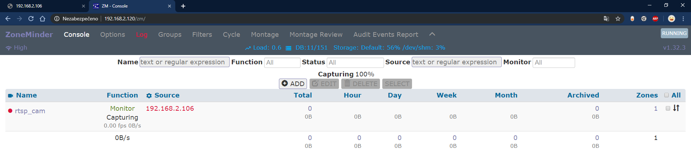

# SmartIN
Martin Šimkovský, IT4
Závěrečná práce- ZoneMinder kamera, externí pir trigger

## Časový harmonogram
- září -> 1 pol. října
  - [x] nakoupení HW
  - [x] nastudování datasheetů, dokumentací 
  - [x] zapojení na nepájivém poli - esp32 CAM + pir senzor
  - [x] ozkoušení software z githubu/ načerpání inspirací
- 2 pol. října -> listopad
  - [x] vytvoření viruálního stroje (ubuntu server konfigurace)
  - [x] ZONEMINDER SERVER (instalace, přidání kamery)
  - [x] kamera (http, rtps stream)
  - [x] komunikace kamery s zoneminder serverem
  - [x] vyhodnocování ze senzorů pohybu + upozornění
  - [ ] upozoznění emailem (PushingBox)
  - [ ] ZM script na trigger z pir sen. 
- prosinec -> leden
  - [ ] pájení
  - [ ] krabička
  - [ ] domumentace
  
## Možné vylepšení do budoucna
- vyvinutí mobilní aplikace
- přidání dalších čidel (okna, dveře)
- meteo stanice v centrální jednotce (MQTT)

Kódy ke zkoušce: 
- [x] https://randomnerdtutorials.com/esp32-cam-video-streaming-face-recognition-arduino-ide/
- [x] https://randomnerdtutorials.com/esp32-cam-pir-motion-detector-photo-capture/
- [x] https://github.com/geeksville/TenDollarWebcam -> finální projekt bude nejspíše inspirován tímto projektem

